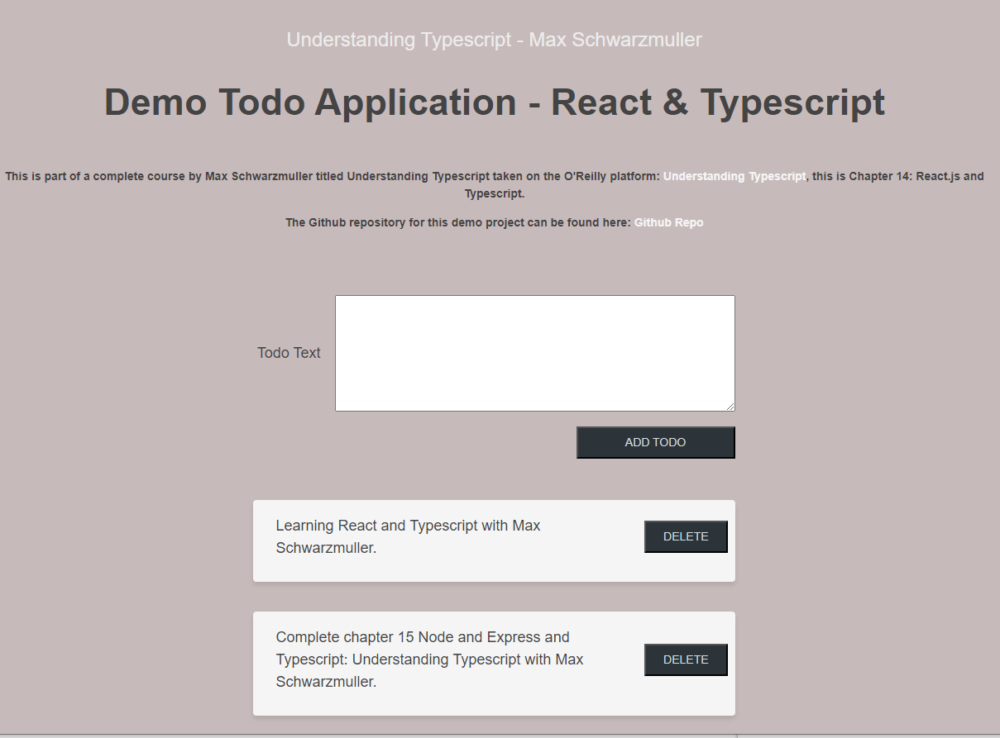

# TABLE OF CONTENTS

[Project Title](#project-title) 
[Description](#description) 
[Snapshot](#snapshot) 
[Deployed](#deployed) 
[Github](#github) 
[LinkedIn](#linkedin) 
[Licence](#licence)

## Project Title

# Demo React Typescript Todo Application

## Description

This is part of a complete course by Max Schwarzmuller titled Understanding Typescript taken on the O'Reilly platform: this is Chapter 14: React & Typescript, building a todo application.

## Snapshot

## Deployed

[Demo Todo Application](https://sho-ayb.github.io/react-typescript-todo-max/)

## Github

[Github](https://github.com/Sho-ayb)

## LinkedIn

[LinkedIn Profile](https://www.linkedin.com/in/shoaybchoudhry/)

## Licence

MIT License

Please click on the badge for more details on the licence.

